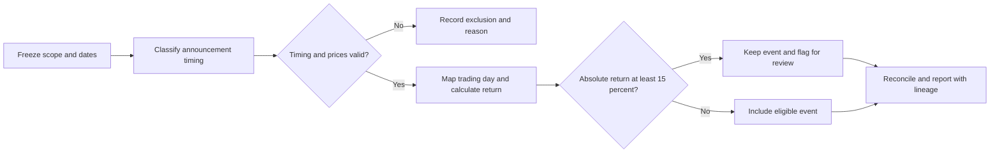

# Making earnings-event analysis traceable

**Hoi Chun Chen · Business analysis case study · Research and simulated operating-model design**

[Portfolio home](README.md) · [Requirements and validation examples](01-earnings-evidence.md)

## At a glance

| Business problem | Earnings-event results were difficult to review without explicit date, eligibility and exception rules. |
| --- | --- |
| My contribution | Defined analytical rules, calculated returns, reconciled Excel/Python outputs and translated controls into requirements and test examples |
| Original outputs | Research analysis and Excel workbook; a BA design pack with 20 requirements, 12 stories and 26 designed UAT cases |
| Published outputs | This case, a workflow diagram, selected requirements, acceptance criteria and validation examples |
| Recorded results | 25 companies; 193 collected events; 192 eligible events; 13 review flags; zero maximum Excel/Python reconciliation difference in the retained report |
| Evidence boundary | Research validation was performed; organisational roles, approval processes and operating-model benefits were simulated. The original workbook and source code are not published in this repository. |

## The problem

An earnings announcement date is not always the trading day on which its reaction should be measured. Results also become difficult to review when missing history, unusual price moves and calculation choices are hidden inside an analysis script.

My research workflow needed a consistent way to answer three questions: which events belong in the analysis, how should their reactions be calculated, and how can a reviewer follow a result back to its source and rule?

## Context and my contribution

The underlying report covered a fixed universe of 25 technology companies and completed earnings events between June 2023 and June 2025. I defined timing and eligibility rules, calculated returns, recorded exceptions and produced an Excel analysis with validation checks.

I also translated the workflow into a BA delivery pack with 20 requirements, 12 user stories, acceptance criteria, a requirements traceability matrix and 26 UAT cases. The pack's organisational roles, interviews, approvals, production controls, adoption and business-benefit estimates were simulated. Writing UAT cases is not evidence of commercial user acceptance or sign-off.

## Decisions that shaped the solution

### 1. Make timing an explicit business rule

For an announcement before market open, use the first trading day on or after the announcement date. For an announcement after market close, use the next trading day. Exclude unknown or intraday timing from the primary analysis and preserve the exclusion reason.

This makes the date decision visible to both an analyst and a reviewer. It avoids treating a calendar date as a sufficient specification.

### 2. Show incomplete coverage instead of filling the gap

The study targeted up to eight events per company. One company, SNDK, contributed one event rather than eight; I retained that limitation instead of inventing or substituting predecessor history.

The fixed company universe also limits generalisation. It is not a reconstruction of historical index membership at each quarter.

### 3. Review extreme observations without removing them

An absolute primary return of at least 15% triggered manual review. Flagged events remained in the data. Removing them automatically would change the question being answered and could hide the cases a reviewer most needs to understand.

## Workflow

The workflow above summarises the executed analytical controls. Role-based access, approval gates and production release were additional design exercises, not implemented systems.

## Validation and observed outputs

| Check | Recorded result | What it establishes |
| --- | --- | --- |
| Scope and eligibility | 193 collected events; 192 in the primary analysis | One intraday or unknown-timing event was visibly excluded |
| Unusual observations | 13 events met the 15% review threshold | Exceptions were retained and made reviewable |
| Calculation reconciliation | Zero maximum difference between the compared Excel and Python calculations | Agreement between the two implementations for the checked results |
| Independent spot checks | Three of three comparisons within one percentage point | Selected outputs agreed with independent news reports within the stated tolerance |

The spot checks do not validate every event, and agreement between calculations does not prove that every source timestamp is correct. The study is descriptive and does not establish that earnings announcements alone caused the measured returns.

## What the BA work adds

The delivery pack makes analysis choices reviewable as requirements: each important rule can be linked to a story, an acceptance criterion and a test scenario. It also identifies where actual stakeholder input would be required before an operational implementation.

The simulated business case made investment conditional on measured handling time, actual costs and a pilot. Its projected savings and payback are not presented as realised outcomes in this public case study.

## Next validation step

For an operational pilot, I would observe the current review process, agree definitions with real users, replace assumed costs and handling times with measurements, and test exception handling with the people responsible for review. That would address the main gap between this research-based demonstration and an adopted business service.

---

Historical analysis window: June 2023–June 2025. Public case-study adaptation: September 2026. Source: my retained S&P 500 Technology Earnings BA report. The public supporting examples are a selected, rewritten explanation of its controls, not a complete independent re-audit of the original workbook.
