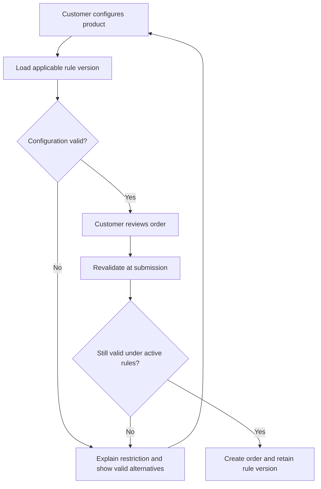

# Preventing invalid furniture orders

**Hoi Chun Chen · Business analysis case study · Reconstructed example with synthetic rules**

[Portfolio home](README.md) · [Rules, stories and test plan](02-furniture-evidence.md)

## The problem

Custom-furniture customers can choose combinations of fabric, colour, size and accessories. A combination may look valid in an ordering interface but still be impossible to manufacture. Discovering that after order submission creates avoidable clarification, rework and disappointment.

This case explores how to validate a configuration before submission, explain the reason for a restriction and keep changing product rules maintainable.

## Context and my contribution

The problem is informed by my part-time custom-furniture operations experience. In that work, I gathered constraints from product, production and supply-chain stakeholders, involved a factory process engineer, documented business rules in Excel and Confluence, and handed requirements to the technical team through Jira. I did not develop the ordering software.

The artefacts published here were newly reconstructed for this portfolio in September 2026. All product names, constraints, example orders, priorities and test cases below are synthetic. They are not copied employer documents, an export of a live system or evidence of a new commercial implementation.

## Discovering the rules

A request to “stop invalid orders” needs several questions answered before it can become a workable requirement:

- Which combinations are physically impossible, and which are only temporarily unavailable?
- Who can confirm that a restriction is a manufacturing constraint rather than a sales preference?
- Do accessories introduce constraints that do not exist for the main product alone?
- What should happen when a customer saves a configuration and a rule changes before submission?
- Who maintains the rules, and what evidence is needed before a revised rule is released?

In the original experience, involving the process engineer helped expose constraints that a document review alone could miss. In this reconstruction, those questions become an explicit elicitation plan; no new interviews are claimed.

## Options and recommendation

| Option | Advantage | Limitation |
| --- | --- | --- |
| Continue checking after submission | Small initial system change | Invalid orders still reach operational teams |
| Add restrictions directly to interface code | Can prevent known combinations | Recurring product changes depend on code changes and risk inconsistent implementations |
| Validate against a versioned rule table | Makes rules inspectable, testable and maintainable | Needs agreed ownership, effective dates and controlled changes |

I recommend a rule-table approach for this portfolio scenario. The same rule version should govern the customer-facing validation and the final submission check. Interface guidance helps the customer, while the submission check protects against stale or bypassed validation.

## Proposed process

This is a proposed portfolio design. It does not depict a verified current employer system.

## Key requirement decisions

**Separate rejection reasons.** A manufacturing restriction should explain the invalid combination. Missing rule information should produce an unavailable-validation message. Treating both as the same error would confuse customers and make operational diagnosis harder.

**Validate again at submission.** A saved basket can outlive a rule change. A fresh server-side check should confirm the active rule version before the order is accepted.

**Make rules testable.** Each rule needs a stable identifier, applicability conditions, a clear result, a message and effective dates. Boundary cases should be included in the test plan.

**Keep the first release narrow.** In this scenario, preventing known non-manufacturable combinations is a Must. More advanced alternatives and analytics can follow once the validation and change process are reliable.

## What I would measure

| Measure | Definition | Use |
| --- | --- | --- |
| Invalid orders reaching production review | Orders rejected for configuration / orders reviewed | Checks whether invalid combinations escape the control |
| False-block rate | Valid configurations incorrectly blocked / independently reviewed blocked attempts | Detects harm from rules that are too restrictive |
| Successful correction | Blocked sessions that submit a valid configuration / blocked sessions, within an agreed window | Tests whether the guidance helps customers recover |
| Rule-maintenance lead time | Elapsed time from an agreed change request to a tested, effective rule | Evaluates maintainability |

No baseline, target or achieved improvement is invented for this reconstructed case. These measures would need agreed definitions, suitable event logging and a measured baseline before benefits could be claimed.

## What the case demonstrates

The useful BA output is the connection between a manufacturing constraint, a customer-facing rule, an acceptance criterion and a test. The supporting file includes concrete examples of that connection and a proposed change-impact assessment.

Before implementation, the next step would be to validate the proposed rules with actual product and production owners, test the error messages with users and agree who authorises rule changes.
