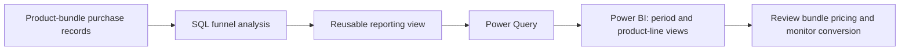

# Furniture bundle conversion analysis

**Hoi Chun Chen · SQL, Power Query and Power BI · Historical work experience**

[Portfolio home](README.md#power-bi)

## At a glance

| Business question | Why were customers buying a complete furniture set converting less often than customers combining individual items? |
| --- | --- |
| Context | WEILAI.CONCEPT, part-time Data Analyst experience, September 2021–September 2022 |
| My contribution | SQL funnel analysis; conversion-window selection; reusable reporting connected through Power Query to Power BI |
| Scope | About 35 bundle combinations; a 30-day conversion window |
| Original deliverable | A Power BI dashboard with period and product-line selection, supported by a reusable SQL reporting view |
| Observed outcome | Complete-set conversion rose from about 19% to 26% after a bundle-discount change supported by the analysis |
| Public evidence | This written experience summary and explanatory reporting flow. The original PBIX, dashboard, queries and employer data are not included. |

## The problem and my judgement

High-ticket furniture purchases often take longer than a week. I used a 30-day conversion window to reflect that decision cycle and separated complete-set purchases from customers assembling a purchase from individual items. Combining those groups would have hidden a meaningful difference in purchasing behaviour.

This was a product-bundle analysis. It was separate from my site-wide customer-journey analysis; the populations and conversion rates should not be combined.

## What I did

1. Used SQL to examine about 35 bundled-product combinations and compare the basket-to-order stage across purchase types.
2. Identified basket-to-order conversion at about 22% overall within this analysis. Complete-set conversion was about 19%, compared with about 33% for individually combined purchases.
3. Converted repeated queries into a reusable, parameterised reporting view and connected it through Power Query to Power BI.
4. Built reporting that could switch period and product line, allowing the same business question to be revisited without rebuilding the analysis.
5. Used the findings to support a change to the bundle discount and monitored subsequent complete-set conversion.

## How the tools supported the decision

| Tool or method | Contribution |
| --- | --- |
| SQL | Prepared the product-bundle funnel and kept the purchase types distinct |
| Power Query | Connected the reporting output to Power BI |
| Power BI | Made period and product-line comparisons reusable for reporting |
| Business analysis | Chose a conversion window suited to the purchase cycle and connected the observed drop-off to a commercial decision |

This diagram is a newly drawn explanation of the historical reporting flow, not a screenshot of the original dashboard or system architecture.

## Metrics and results

| Metric in this analysis | Recorded value | Interpretation |
| --- | --- | --- |
| Basket-to-order conversion | About 22% | The largest funnel loss identified in this product-combination analysis |
| Complete-set conversion before the change | About 19% | Lower than conversion for customers combining individual items |
| Individually combined purchase conversion | About 33% | A comparison group with a different purchasing pattern |
| Complete-set conversion after the change | About 26% | Approximately 7 percentage points above the earlier complete-set rate |

The conversion measure concerns progression from basket to order within the stated analysis window. The retained experience account does not include the original SQL grain, deduplication rules, exact observation dates or an experimental control group. I therefore report the approximate historical rates without claiming an independently reproduced calculation or a causal estimate of the discount's effect. The 33% comparison group is not an A/B-test control.

## What this demonstrates

The contribution combines business judgement with reporting: choosing an appropriate window, separating different customer decisions, producing a reusable view and explaining a finding that informed action. Power BI made the analysis easier to revisit; the business value depended on clear definitions and a decision that someone could act on.

Publication status: September 2026 experience write-up. Original dashboard files and screenshots are not available in this public edition. No DAX measures, data-model screenshots or dashboard demonstrations are presented as historical artefacts without their supporting files.
